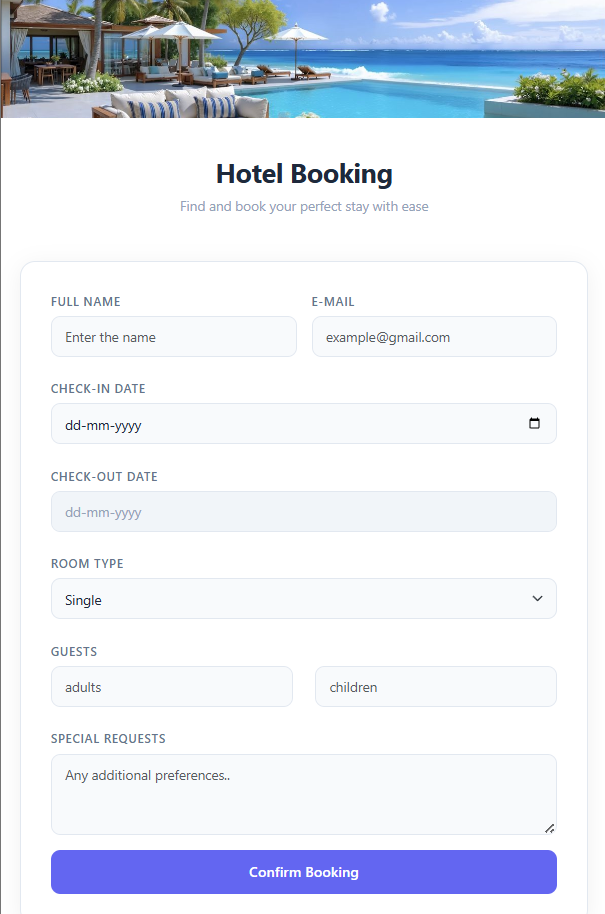

# 🏨 Hotel Booking Form

## Project Overview
A fully functional Hotel Booking Form built with React and Bootstrap.
Users can fill in their details, select check-in/check-out dates, 
room type, and number of guests. The form includes validations and 
confirmation alerts.

---

## Features
- Full name and email input
- Check-in / Check-out date picker with validation
- Check-out cannot be before check-in
- Room type selection (Single, Double, Suite)
- Guests count (Adults & Children)
- Special requests textarea
- Form validation using Bootstrap + React state
- Success alert on booking confirmation
- Form resets after successful submission

---

## Technologies Used
| Technology | Purpose |
|------------|---------|
| React (Vite) | Frontend framework |
| Bootstrap 5 | UI styling and layout |
| CSS | Custom styling |
| JavaScript | Logic and validation |

---

## Instructions to Run the Project

### Prerequisites
- Node.js installed
- Git installed

### Steps
```bash
# 1. Clone the repository
git clone https://github.com/shrutika-gawande/Hotel-Booking-Platform.git

# 2. Go into the project folder
cd hotel-booking-platform

# 3. Install dependencies
npm install

# 4. Run the project
npm run dev

# 5. Open in browser
http://localhost:5173
```

---

## Deployed Link
🔗 [Click here to view live] https://hotel-booking-form-five.vercel.app/

---

## GitHub Repository
🔗 [Click here to view source code] https://github.com/shrutika-gawande/Hotel-Booking-Platform

---

## Screenshots
